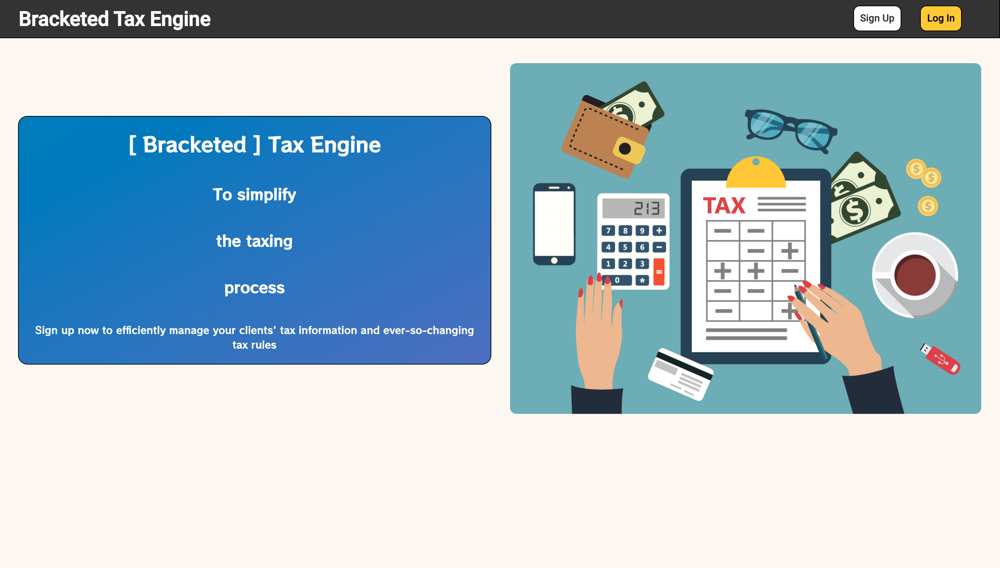
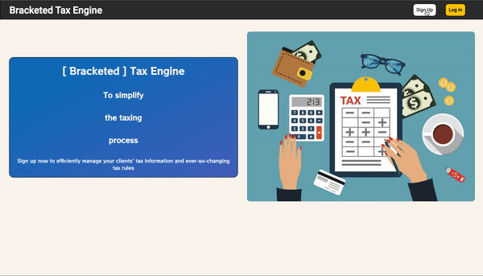
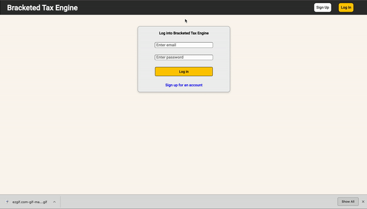
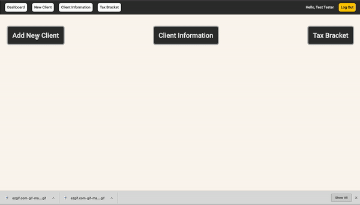
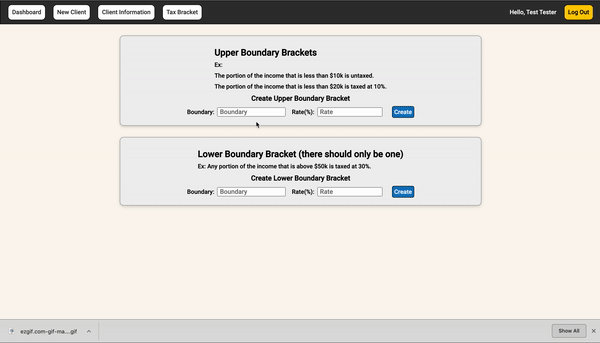

# Bracketed Tax Engine

## [Live Site](https://bracketed-tax-engine.herokuapp.com/#/)



## Assignment
### General Direction
Write a program that calculates income tax based on the following rules:
* The portion of the income that is less than $10k is untaxed
* The portion of the income that is less than $20k is taxed at 10%
* The portion of the income that is less than $50k is taxed at 20%
* Any portion of the income that is above $50k is taxed at 30%

### Prompt 1
* Assume this aplication will be used by a 3rd party tax consultant who will have to run this for 100 clients.
* Write a program that is scalable.
* The program should take the $ income and return the tax amount

### Prompt 2
* Imagine there are actually 50+ brackets that change every year, and we need to compute 1
Billion income tax projections every year.
* Describe in a few bullet points how you’d build a solution that scales.

## Installation Instruction
### Installing dependencies
* Delete ```Gemfile.lock``` and ```package-lock.json```
* Type ```bundle install``` into the command line
* Type ```npm install``` into the command line
### Running the application locally
* Type ```rails s``` into the command line
* Type ```npm start``` into the command line
* Go to ```http://localhost:3000/#/```

## Navigation Instruction
### New User - Sign Up
You can sign up for an account by filling out your information, and you will be sent to your dashboard



### Existing User - Log In
Log into your account



### Adding new client
Type in the ```first name```, ```last name```, ```email```, and ```income``` of a client to add to the database. Afterwards, you will be redirected to the client information page.



When entering the first client, there's an ```error message```, indicating you to enter in tax bracket information to be used for calculating the tax information. 

### Adding tax brackets
Tax bracket with upper boundary such as ```The portion of the income that is less than $20k is taxed at 10%```, needs to be entered into the ```Upper Boundary Brackets``` form. 

Tax bracket with lower boundary such as ```Any portion of the income that is above $50k is taxed at 30%```, needs to be entered into the ```Lower Boundary Bracket``` form. Notice that you can only have one. The assumption is that there is only one tax bracket that captures the portion of income that is higher than a certain amount. 




